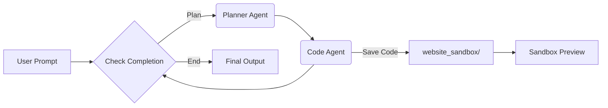

#  Website(UI) Builder Agent

An AI-powered autonomous agent that designs and builds responsive websites from natural language prompts — using a **LangGraph workflow**, **multi-agent collaboration**, and **real-time code generation**.

> ✨ *Describe a UI → Agent plans, writes, and deploys live HTML/CSS/JS — all in your browser.*


---

## 🌟 Features

- **Natural Language to UI**: “Create a dark-themed landing page with a hero section and CTA button” → full website.
- **Autonomous Workflow**: Router → Planner → Code Agent → Validation loop.
- **Live Sandbox Preview**: Real-time iframe rendering of generated code.
- **Stateful Session**: Chat history, iterative refinement, and code updates.
- **Local & Private**: Runs entirely on your machine — no external APIs required.
- **Optimized for High VRAM GPUs**: Designed for NVIDIA RTX A6000 (48GB VRAM) with vLLM backend.

---

## 🏗️ Architecture



- **LangGraph State Machine**: Orchestrates agent coordination and loop logic.
- **vLLM Backend**: Serves `Qwen/Qwen3-14B` with high throughput & low latency.
- **FastAPI + Jinja2**: Web UI with clean dark-blue theme and real-time updates.
- **File-Based Sandbox**: Generated website served directly from `app/website_sandbox/`.

---

## 🛠️ Requirements

### Hardware (Recommended)
- **GPU**: NVIDIA RTX A6000 (48GB VRAM)
- **System RAM**: ≥ 32 GB
- **Storage**: ≥ 30 GB free (model + dependencies)

### Software
- Python ≥ 3.10
- CUDA ≥ 12.1
- vLLM ≥ 0.4.3
- PyTorch ≥ 2.3
- Hugging Face `transformers`, `tokenizers`
- `langchain`, `langgraph`, `fastapi`, `uvicorn`, `jinja2`

---

##  Quick Start

### 1. Clone & Install

```bash
git clone https://github.com/Alirezasalb/Website-UI-Builder-Agent.git
cd Website-UI-Builder-Agent

# Virtual environment (recommended)
python -m venv venv
source venv/bin/activate  # Linux/macOS
# venv\Scripts\activate   # Windows

pip install -r requirements.txt
```


---

### 2. Launch vLLM Server (Qwen3-14B)

> ⚠️ **Run this FIRST in a dedicated terminal** — it takes 2–5 minutes to load on A6000.

```bash
python -m vllm.entrypoints.openai.api_server \
  --model Qwen/Qwen3-14B \
  --host 0.0.0.0 \
  --port 7052 \
  --dtype bfloat16 \
  --max-model-len 32768 \
  --gpu-memory-utilization 0.9 \
  --trust-remote-code
```

✅ **A6000 Optimization**:
- `--dtype bfloat16`: Best speed/accuracy trade-off.
- `--gpu-memory-utilization 0.9`: Uses ~43GB VRAM — safe for 48GB card.
- `--max-model-len 32768`: Supports long UI descriptions and code.


---

### 3. Launch Web UI (FastAPI)

In a **second terminal**, activate your venv and run:

```bash
uvicorn app.web.main:app \
  --host 0.0.0.0 \
  --port 7051 \
  --timeout-keep-alive 300
```

Then open:  
👉 [http://localhost:7051](http://localhost:7051)

---

## 🧪 Usage

1. Type a prompt:  
   > *“Build a responsive pricing page with three tiers, gradient buttons, and dark mode.”*

2. Click **🚀 Send** — the agent will:
   - Route the request
   - Generate HTML/CSS/JS
   - Save files to `app/website_sandbox/`
   - Update chat history & code view
   - Auto-refresh the sandbox preview

3. Iterate:  
   > *“Make the middle plan highlighted with a pulsing border.”*

✅ The `code-editor` textarea and live iframe update automatically.

---

## 📁 Project Structure

```
app/
├── api/
│   └── routes.py                 # HTTP endpoints: /, /process_request, /sandbox/
├── core/
│   ├── agents.py                 # Router, Planner, Code Agent nodes
│   ├── graph.py                  # LangGraph workflow definition
│   ├── llm.py                    # LLM client (points to vLLM OpenAI API)
│   └── state.py                  # AgentState TypedDict
├── tools/
│   └── code_editor.py            # Reads/writes files in website_sandbox/
├── web/
│   ├── main.py                   # FastAPI app entrypoint
│   ├── static/
│   │   ├── css/styles.css        # Dark, modern UI theme
│   │   └── js/script.js          # Cache-busting sandbox refresh
│   └── templates/
│       └── index.html            # Jinja2 frontend template
└── website_sandbox/              # 🌐 Generated website (index.html, style.css, script.js)
```

---

## 📝 Notes

- **LLM Endpoint**: `app/core/llm.py` must point to `http://localhost:7052/v1` (vLLM OpenAI API).
- **Sandbox Serving**: `/sandbox/*` routes serve files from `website_sandbox/` with correct MIME types.
- **State Management**: Uses in-memory global state (for demo); replace with Redis/session for production.
- **Security**: Do **not** expose ports `7051`/`7052` publicly — this is a local dev tool.
- **NDA Compliance**: Internal logic and company-specific enhancements are protected.

---

## 📜 License

This project is for demonstration, research, and internal use only.  
© 2025 Alireza Salbizadeh. — All rights reserved.

---

## 🙌 Acknowledgements

- [vLLM](https://vllm.readthedocs.io) — for efficient, scalable LLM serving  
- [LangGraph](https://langchain-ai.github.io/langgraph/) — for stateful, cyclic agent workflows  
- [Qwen](https://qwenlm.github.io) — outstanding open-source LLM by Alibaba  
- Inspired by autonomous UI agents, RAG, and tool-use patterns in modern LLM systems.

---

> 🔮 *The future of frontend development is conversational.*  
> Try it. Iterate. Ship.
```